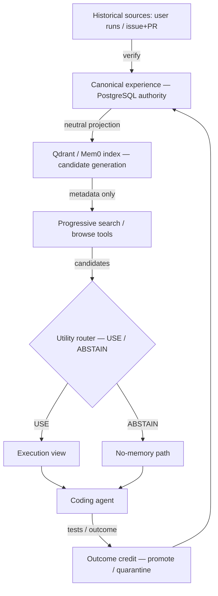

# Enterprise Shared Memory

A governed **shared-memory service for coding agents**: it stores verified coding experience, retrieves candidates
from a replaceable vector index, and applies a **utility-aware router** that decides `USE` / `ABSTAIN` before any
memory reaches a model — rejecting redundant, out-of-scope, stale, or harmful experience and never leaking across
tenants. Every decision is auditable and maps back to a canonical version in PostgreSQL.

<!-- STATUS:BEGIN -->
| Dimension | Status |
| --- | --- |
| Version | `0.3.0rc1` |
| Service plumbing | `IMPLEMENTED` |
| Research efficacy | `MEMORY_TRANSFER_EFFICACY_NULL` |
| Utility router (held-out) | `NULL` |
| Company handoff | `READY` |
| Production certification | `NOT_CLAIMED` |
| Migration head | `0014` |

> **COMPANY-HANDOFF-READY — NOT YET COMPANY-STAGING-CERTIFIED.** Service correctness, research efficacy, and staging certification are tracked separately; see [`docs/STATUS.yaml`](docs/STATUS.yaml) (single source of truth) and [`docs/EVIDENCE_AND_LIMITATIONS.md`](docs/EVIDENCE_AND_LIMITATIONS.md).
<!-- STATUS:END -->

## What it does
- **Compiles** verified source resolutions (public issue+PR+patch, or a verified agent job) into canonical
  **experience cards** (symptom → root cause → fault localization → repair strategy → validation), each with three
  projections: canonical (authoritative), a **neutral retrieval projection** (metadata only, embeddable), and an
  **execution view** (actionable, injected only after approval).
- **Searches** metadata only, then **browses** the execution view **only after** tenant/repo/path/version/
  governance gates *and* the utility router approve.
- **Routes** each candidate `USE`/`ABSTAIN` with a deterministic, inspectable policy (frozen reason codes).
- **Credits** outcomes (gain / loss / neutral / compute-only) with adoption evidence, and **governs** card
  lifecycle (candidate → probation → promoted; repeated harm → quarantine) with mandatory human review.

## What it does NOT claim
- It does **not** claim that shared memory improves coding-task success. In our controlled study, injecting another
  engineer's solved experience gave **no reliable benefit** (REALBENCH R14–R18: five levers all null on SWE-bench
  Verified — [`reports/MEMORY_TRANSFER_SYNTHESIS.md`](reports/MEMORY_TRANSFER_SYNTHESIS.md)). Any performance claim
  is gated on the held-out utility-router endpoint (`utility_router_result` in [`docs/STATUS.yaml`](docs/STATUS.yaml)).
- It is **not** production-certified. `COMPANY-HANDOFF-READY` ≠ `COMPANY-STAGING-CERTIFIED` ≠ production.
- Three claim axes are tracked **separately**: **service correctness**, **research efficacy**, **staging certification**.

## Five-minute offline demo (no credentials)
```bash
python -m venv .venv && . .venv/bin/activate     # Windows: .venv\Scripts\activate
python -m pip install -e ".[dev]"
python scripts/demo_company_handoff.py --offline   # -> DEMO_PASS: true
```
The demo runs the full governed flow (compile → promote → search → route → inject → credit → quarantine →
private-isolation → audit) with zero infra and writes `artifacts/p6/demo_evidence.json`.

## Docker Compose quick start
```bash
cp .env.example .env                               # placeholders only; fill from your secret store
docker compose -f deploy/docker-compose.company.example.yml up -d   # Postgres + Qdrant + API
make smoke
```

## Architecture

- **Control plane** (PostgreSQL): authoritative cards, versions, decisions, audit — the source of truth.
- **Retrieval index** (Qdrant/Mem0): replaceable candidate generator over neutral projections; **never** canonical.
- **Execution view**: compiled from the canonical version, injected only after gates + router approve.

## Memory lifecycle
`candidate` → (source verified) → `probation` → (≥2 gains, 0 losses, **manual review**) → `promoted`;
repeated `MEMORY_LOSS` → `quarantined`; version invalidation → `deprecated`. Quarantined/deprecated/deleted cards
are never searchable. Thresholds are frozen (`artifacts/p6/governance_thresholds.json`).

## Run modes (`MEMORY_POLICY_MODE`)
`off` · `static_relevant` · `agentic_reference` (search/browse, no router) · `utility_gated` (search/browse +
router) · `shadow` (run the router, persist decisions, inject nothing). **Recommended pilot: `shadow`, then
`utility_gated` with reviewed promoted cards only.** A client cannot select the arm or bypass server policy.

## HTTP example
```bash
curl -sX POST "$EM/v1/experience-cards/search" -H "Authorization: Bearer $TOKEN" \
  -d '{"query":"loader crash missing config key","repository":"acme/widgets","subtask":"modification"}'
# -> metadata-only candidates; then POST /v1/memory-browse to obtain a gated execution view.
```

## MCP / Claude-Code-like integration
```bash
python -m enterprise_memory.mcp.server        # stdio MCP: memory_search / memory_browse / report_outcome / explain_decision
python examples/company_harness/http_adapter.py   # offline, zero-infra integration example
```
Identity is derived server-side; credentials never appear in tool payloads. See
[`examples/company_harness/`](examples/company_harness/) and [`docs/API_AND_MCP.md`](docs/API_AND_MCP.md).

## Security model (summary)
PostgreSQL **RLS (ENABLE+FORCE)** per tenant; private/shared physical+logical separation; OIDC/JWKS bearer +
scopes (`memory:search|browse|feedback|review|admin`); append-only audit; immutable versions; secrets/PII never
logged; verifier & hidden tests never exposed. Full model: [`docs/SECURITY_AND_PRIVACY.md`](docs/SECURITY_AND_PRIVACY.md).

## Evidence table
| Claim | Status | Evidence |
| --- | --- | --- |
| Service plumbing / isolation / governance | PASS in CI | ci-experience-schema, ci-utility-router, ci-agentic-search, ci-outcome-governance, ci-company-demo |
| Relevant memory selected; irrelevant abstained; harmful quarantined; private not leaked | PASS in CI | offline demo (`DEMO_PASS`), router + governance tests |
| Shared memory **improves** coding performance | **NOT ESTABLISHED** | R14–R18 null; utility-router held-out = `utility_router_result` in STATUS |
| Production certification | NOT CLAIMED | no company staging env / sign-off |

## Company pilot recommendation
Run `shadow` mode against a mirror of your repositories to collect router decisions and outcome credits with **zero
injection risk**; review the audit; then enable `utility_gated` with reviewed, promoted cards. Acceptance criteria:
[`docs/COMPANY_ACCEPTANCE_CHECKLIST.md`](docs/COMPANY_ACCEPTANCE_CHECKLIST.md).

- [한국어 Quick Start](docs/COMPANY_QUICKSTART_KO.md) — 10분 이해 · 15분 오프라인 인수검사 (Korean quick start)
- [한국어 회사 도입·구현 안내서](docs/COMPANY_IMPLEMENTATION_GUIDE_KO.md) — clone → 설정 → 실행 → 검사 → 통합 (Korean onboarding guide)

## Repository layout
`src/enterprise_memory/{experience,agentic,router,governance,mcp,adapters,service,serving,backends}` ·
`migrations/` (Alembic, head 0014) · `scripts/` · `examples/company_harness/` · `docs/` · `reports/` (frozen
research) · `deploy/`.

## Operations & troubleshooting
Health checks, migrations, Qdrant reindex, outbox replay, backup/restore, audit export, disabling memory globally:
[`docs/OPERATIONS_RUNBOOK.md`](docs/OPERATIONS_RUNBOOK.md).

## Research reproduction
Frozen manifests, arms, official grader, literature reproduction & causal attribution:
[`docs/RESEARCH_REPRODUCTION.md`](docs/RESEARCH_REPRODUCTION.md) and [`reports/`](reports/). No credentials or
private data are required or included.

## Limitations & production checklist
[`docs/EVIDENCE_AND_LIMITATIONS.md`](docs/EVIDENCE_AND_LIMITATIONS.md) ·
[`docs/PRODUCTION_READINESS_REPORT.md`](docs/PRODUCTION_READINESS_REPORT.md). Company inputs still required:
model/harness manifest, staging environment + sign-off, OIDC issuer, deployment targets, repository access policy.

## License
Apache License 2.0 (SPDX: `Apache-2.0`). See [`LICENSE`](LICENSE), [`NOTICE.md`](NOTICE.md), and
[`THIRD_PARTY_NOTICES.md`](THIRD_PARTY_NOTICES.md). The Apache-2.0 grant applies to this project's own source
code; dependencies and referenced benchmarks/datasets retain their own licenses — see
[`docs/OSS_SCOPE_AND_DATA_POLICY.md`](docs/OSS_SCOPE_AND_DATA_POLICY.md).
