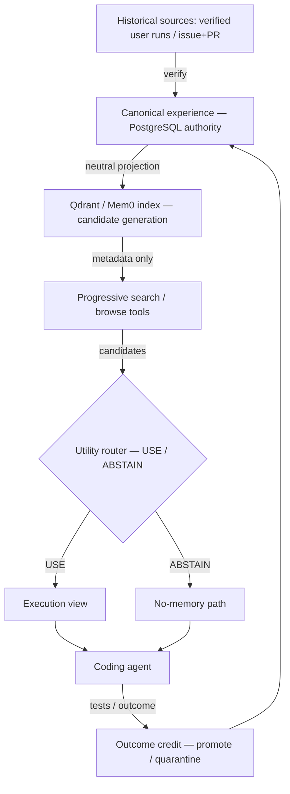

# Architecture

**PostgreSQL is authoritative. Qdrant/Mem0 are replaceable retrieval indices, never the source of truth.**

## Layers
- **Control plane (PostgreSQL):** experience cards + immutable versions, sources/outcomes, search sessions,
  candidates, browse events, decisions, policy versions, outcome credits, counterfactual links, usage aggregates
  (migration `0014`, 13 tables). RLS ENABLE+FORCE per tenant; append-only version/decision/audit rows.
- **Retrieval index (Qdrant/Mem0):** embeds only the **neutral projection** (metadata). Disposable and
  rebuildable by replaying `EXPERIENCE_INDEX` outbox events. Never canonical.
- **Agentic layer:** `search_experiences` (metadata) → utility router (`USE`/`ABSTAIN`) → `browse_experience`
  (execution view) → `report_memory_outcome`. Budgets: search rounds, browse count, injected tokens, cards.
- **Governance:** outcome credit (gain/loss/neutral/compute-only + adoption evidence) → state machine
  (candidate→probation→promoted; quarantine; deprecate) with frozen thresholds and mandatory review.

## Trust boundaries
- The execution view is compiled from the canonical version, never from vector text.
- The verifier and hidden tests never enter a card, projection, or the model context.
- Identity/tenant/policy are server-side; clients cannot set them.

## Data flow (sequence)
1. Ingest verified source → compile canonical card + neutral projection + execution view.
2. On a target subtask: search (index) → candidates (metadata) → router decision (persisted).
3. On `USE` + gates + budget: reload canonical → return execution view → record browse/injection.
4. After grading: assign outcome credit (future targets only) → governance transition → outbox reindex.

## Failure handling
DB is authoritative and transactional; index outages degrade to no-candidates (fail-safe, no injection); the
router fails closed on any leakage sentinel; durable jobs + outbox are idempotent and replayable.

## Deployment topology
API service + separate worker + PostgreSQL + Qdrant. Example compose:
`deploy/docker-compose.company.example.yml`.
