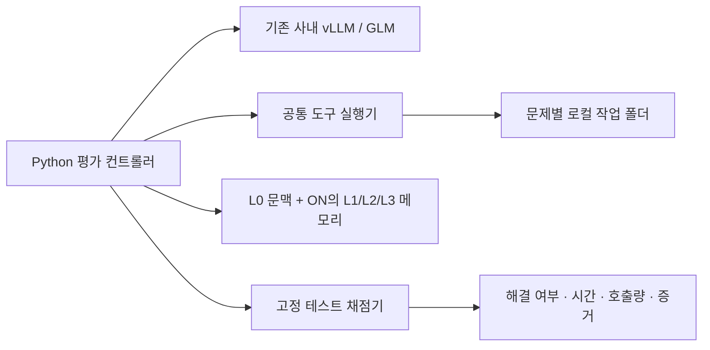

# 하이닉스 제공 컨테이너 안에서의 메모리 평가

2026-09-23 사용자 확인에 따른 **후속 실험의 환경 요구사항과 설계**다.
이 문서는 새 실행기 구현·사내 접속·해결률 평가 완료를 뜻하지 않는다.

공개 벤치마크 후보와 로컬 Astra / 사내 GLM의 공통 비교 설계는
[2026-09-23 벤치마크 조사](../reports/SKHYNIX_PUBLIC_BENCHMARK_SELECTION_20260923.md)에 정리했다.

## 확인된 환경

| 항목 | 확인 내용과 설계 기준 |
| --- | --- |
| 실행 위치 | 이미 제공된 Linux 컨테이너 내부 |
| Docker | 실험이 추가 Docker 설치·데몬·소켓·중첩 컨테이너 실행을 요구하면 안 됨 |
| 언어 도구 | Python 사용 가능. 컴파일러는 사용 가능할 것으로 예상되며 버전·패키지는 확인 전 |
| 모델 | 이미 사내 vLLM으로 제공되는 GLM API 사용 |
| 네트워크 | 사내 모델 접근을 전제로 함. 외부 인터넷·패키지 저장소 접근은 실험의 필수 조건으로 두지 않음 |
| 권한·GPU | 관리자 권한, GPU 접근, 새 모델 서버 설치를 평가 클라이언트의 필수 조건으로 두지 않음 |

미확인 값은 GLM의 정확한 모델 ID·버전, vLLM 버전, API 주소·인증 방식,
허용 컨텍스트·출력 길이, 도구 호출 지원, 요청 병렬 제한, Python·컴파일러·패키지 버전,
영구 저장 경로와 코드 실행 권한이다. 현재 Astra의 `high`나 1,200초 예산을
GLM에서도 검증 없이 같은 의미로 취급하지 않는다.

## 기존 코드에서 유지할 부분과 교체할 부분

| 구성 | 현재 근거 | 후속 방향 |
| --- | --- | --- |
| L0 작업 문맥 | `src/enterprise_memory/trimem/subgoal_context.py` | 새 세션·작업 요약과 기록 구조 재사용 검토 |
| L1/L2/L3 메모리 | `skill_memory.py`, `skill_runtime.py`, `scripts/trimem_skhynix_architecture_memory.py` | Python·SQLite 기반 저장·검색·승격·무효화 로직 재사용 |
| 모델 연결 | `scripts/trimem_skhynix_host_profile.py`에 `NATIVE_POSIX` 및 provider 설정 존재 | 기존 사내 GLM 서비스에 연결. 실제 tool call·반환 형식·예산 집계 호환은 별도 확인 |
| 작업 환경 | `scripts/trimem_skhynix_architecture_environment.py`는 동결 Docker runner를 요구 | 새 실행 경로에서 문제별 로컬 작업 복사본과 명시적 Python 실행 파일 사용 |
| 채점 | `scripts/trimem_official_grader.py`의 현재 SWE-bench 공식 경로는 Docker 의존 | 로컬로 실행 가능한 문제의 고정 테스트로 별도 grader 구현 필요 |
| 배포 확인 | `scripts/server_preflight.py`는 Docker와 로컬 GPU를 검사하는 기존 호스트용 | 새 경로에서는 이미 주어진 실행 환경과 모델 서비스 접근·로컬 테스트 실행을 확인 |

**현재 호스트 프로파일만 바꿔서는 Docker 없는 SWE-bench 평가가 완성되지 않는다.**
기존 `docs/port/AGENT_BRIEF.md`의 설정·이미지·GPU 안내는 Docker 사용 가능한
SWE-bench 호스트를 전제로 한 이전 경로다.

재사용할 모듈의 전이 import 의존성도 확인한다. 현재 패키지 일부는 SQLAlchemy
등을 함께 불러오므로 Python·SQLite가 있다는 사실만으로 전체 설치가 끝났다고
판정하지 않는다. Git 작업 공간을 쓰는 경우 Git과 사전 반입된 저장소도 필요하다.

메모리의 Docker 없는 회귀·연결 검증은 이미 `scripts/trimem_skhynix_evaluate.py`에
있지만 `ReplayModelGateway`와 `ReplayGraderGateway`를 쓰는 고정 응답 검증이다.
그 통과율을 GLM 해결률이나 메모리 성능 향상으로 보고하지 않는다.

## 제안하는 실행 구조

제공 컨테이너 안에서 실행되는 Python 프로그램을 만든다. 모델 서버를 다시
띄우거나 GPU를 점유할 필요가 있는 구조로 만들지 않는다. 의존성이 필요하면
반입 가능한 wheel·문제 파일·데이터·모델 자원을 버전과 해시로 고정한다.
실행 중 자동 `pip install`, 이미지 다운로드, 외부 임베딩 API를 요구하지 않는다.
문제별 작업 폴더와 필요시 사용자 영역 가상환경을 쓰되, venv 자체는 보안 격리가
아니므로 실제 코드 실행 범위·시간 제한·하위 프로세스 정리를 실행기에 명시한다.

vLLM은 호환 HTTP API를 제공하지만 실제 GLM 서비스의 도구 호출 지원은
모델·서빙 버전·템플릿 설정에 따라 확인해야 한다.
특정 `glm47` parser나 `reasoning_effort=high`를 미리 강제하지 않는다.
이미 운영 중인 서비스의 변경을 요구하는 절차를 클라이언트 설치 단계에 넣지 않는다.
[vLLM API 문서](https://docs.vllm.ai/en/latest/serving/online_serving/openai_compatible_server/),
[도구 호출 문서](https://docs.vllm.ai/en/latest/features/tool_calling/).

## 문제 선택과 비교 원칙

주평가 후보는 **현재 컨테이너의 고정 의존성으로 실행 가능한 여러 파일의
저장소 수정 문제**다. 저장소 관계를 쓰는 L2와 검증 절차를 쓰는 L3가 도움이 되는지
볼 수 있도록 문제를 정하고, 해결 결과를 보기 전에 문제·분할·채점 기준을 고정한다.
자체 구성한 문제 집합이면 내부 평가임을 명시한다. LLM의 자기평가로 채점을 대체하지 않는다.

HumanEval+/MBPP+의 로컬 실행 경로는 모델 연결·채점의 보조 비교 후보지만,
그 결과만으로 저장소 수준 L0~L3 전체의 효과가 검증됐다고 주장하지 않는다.
패키지·OS 요구사항과 반입 가능성을 먼저 확인한다.
[EvalPlus 공식 실행 안내](https://github.com/evalplus/evalplus),
[실행 격리 설명](https://github.com/evalplus/evalplus/blob/master/docs/execution.md).

현재 SWE-bench 공식 평가는 Docker 기반이다. 그 문제의 일부를 별도 로컬 실행기로
옮긴다면 별도 평가로 표시하고, 환경·테스트 동등성을 확인하기 전에는 공식 점수와
동일하다고 부르지 않는다.
[SWE-bench 공식 안내](https://www.swebench.com/SWE-bench/guides/quickstart/).

- OFF와 ON은 같은 GLM·문제·공통 L0·도구·예산·채점·병렬도를 사용한다.
- ON만 동결된 L1/L2/L3 장기 메모리를 검색·주입한다.
- 경험 수집 문제와 평가 문제를 분리하고, 동일 문제 재풀이와 다른 문제로의 전이를 구분한다.
- 평가 데이터로 은행을 갱신하지 않고, 실행 불가·모델 오류·판정 보류를 별도 기록한다.
- 주실험용 GLM 경험 수집과 기존 Astra 은행을 쓰는 전이 실험은 출처를 구분한다.
  기존 Astra ON/OFF 점수와 새 GLM 점수를 빼서 메모리 효과라고 해석하지 않는다.
- 시간은 모델 대기·도구 실행·채점·총 소요 시간을 분리하고, 호출·토큰·도구 사용량과
  메모리 검색·주입·실제 사용 근거를 가능한 범위에서 함께 기록한다.

다음 구현 순서는 **환경 확인 → 추가 Docker 없이 1문제의 모델 도구 호출·수정·채점
완주 → 작은 동일 문제 OFF/ON 비교 → 본평가 설정 동결·확대**다.
현재 Windows/WSL의 v20 실험은 이번 문서 변경으로 중단하거나 설정을 변경하지 않았다.
